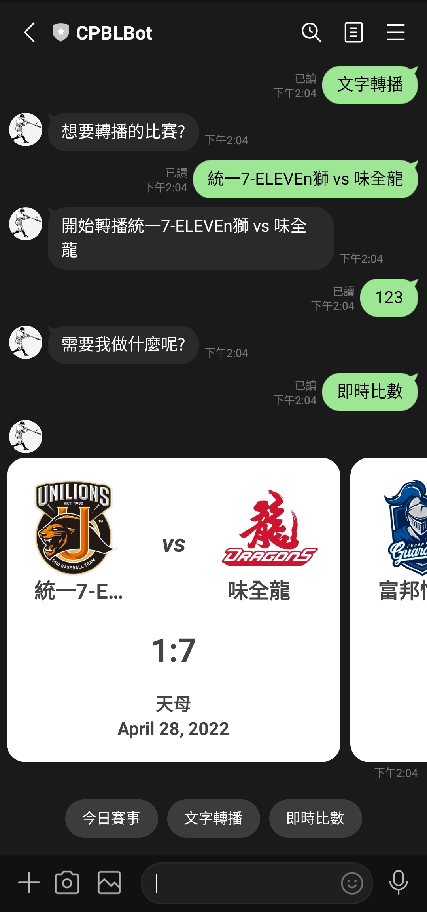
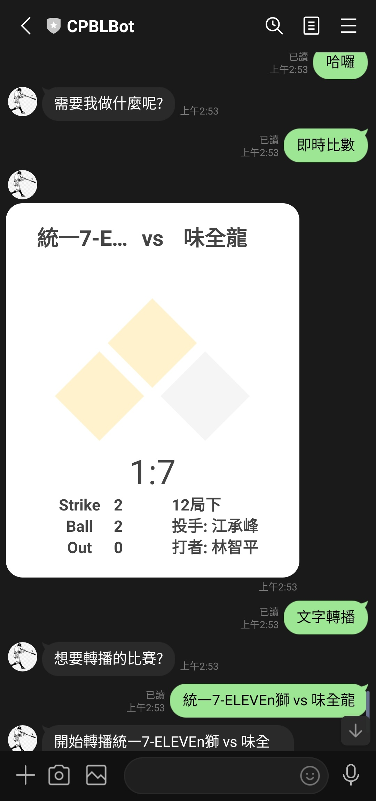
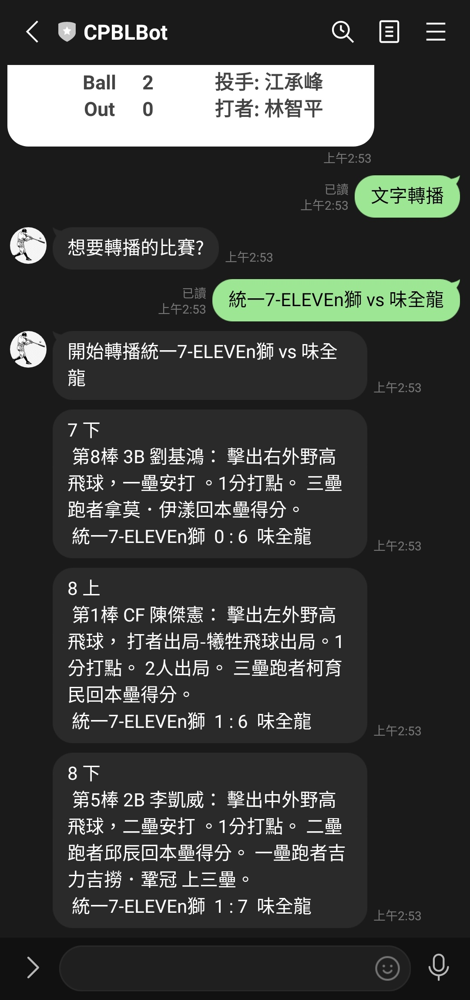

# CPBL Line bot - 中華職棒聊天機器人

[](https://opensource.org/licenses/MIT)
[](https://badge.fury.io/py/lotify)

<a href="https://lin.ee/sxU8wpe"></a>  


# Features
- 今日賽事
- 即時比數
- 文字轉播

| 今日賽事                             | 即時比數                             | 文字轉播                             |
|----------------------------------|----------------------------------|----------------------------------|
|  |  |  |

# Prerequisite

- flask/Python 3.8
- LINE v10.14
- redis

> You need GitHub, LINE, Heroku accounts to deploy this bot.

# Developer Side

## Environment property

Fill in the following environment variables:

```
LINE_CHANNEL_ACCESS_TOKEN=
LINE_CHANNEL_SECRET=
DATABASE_URL=
```

> You need to modify REDIS_URL as your redis settings.

## LINE account (LINE_CHANNEL_ACCESS_TOKEN, LINE_CHANNEL_SECRET)

- Got A LINE Bot API developer account Make sure you already registered, if you need use LINE Bot.

* Go to LINE Developer Console
    - Close auto-reply setting on "Messaging API" Tab.
    - Setup your basic account information. Here is some info you will need to know.
        - Callback URL: `https://{YOUR_URL}/webhooks/line`
        - Verify your webhook.
* You will get following info, need fill back to `.env` file.
    - Channel Secret
    - Channel Access Token (You need to issue one here)

## Server 

1. Install requirement.txt
    ```
    pip intsall -r requirements.txt
    ```

2. Start the app.

    ```
    python app.py
    ```

3. Create a provisional Https:

    ```
    ngrok http 5000
    ```

4. Copy URL to LINE Developer Console

## Crawler

1. start the web crawler to update CPBL games data

    ```
    python crawler.py
    ```

# License

MIT License